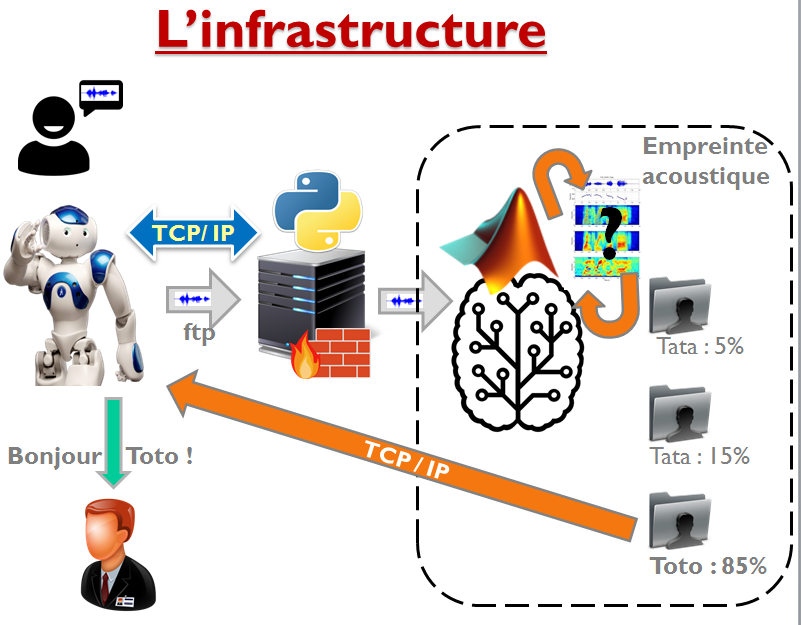
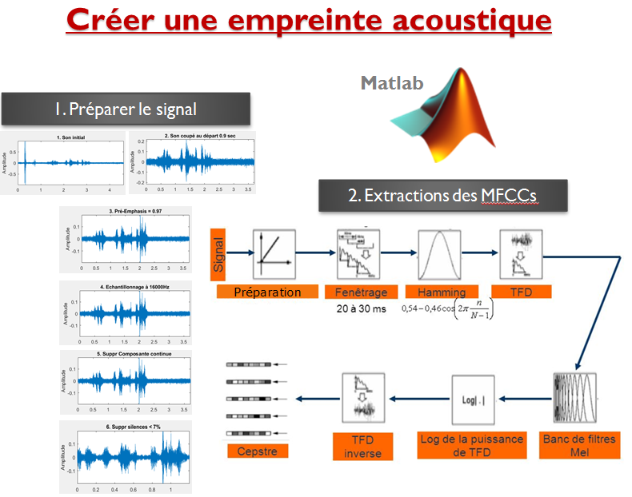

# Speaker Recognition with the robot NAO

## Key words
- Choregraph Nao
- Matlab
- Python
- socket TCP/IP
- FTP
- Artificial Intelligence : neural network and machine learning
- Biosignature

**Demo : docs/nao_ral_demo_recog.mp4 and docs/nao_ral_demo_train.mp4**

## Summary
Talking is the main communication method for human beings. Thanks to it, we can recognize the speaker. We can even guess his mood with his voice pitch. Robots are not naturally very sensitive to the voice. 
We usually ask them to understand our words and then execute our orders. That will not be our target. In fact, our goal is to analyze the speaker voice and then identify him. We are going to teach the robot Nao how to recognize a voice.

We can consider Nao as a child. Indeed, we have to teach it how to analyze a voice and how to associate a sample with someone. As you must have understood, two phases are required. 

* The first one is the audio signal treatment. At first, we have to clean and normalize the signal. The next step is to extract the MFCC. MFCC means Mel-Frequency Cepstrum Coefficients. To be simple, MFCC are the main voice characteristics. They are the digital representation of a voice; it is like a signature. As the processes are quite heavy because of the many mathematical operations, we have opted to use Matlab which is a rich numerical computing environment. Matlab is omnipresent in the scientific world thanks to its performance. It would be a shame to not exploit it.

* The second one is to associate the extracted MFCC with a name. The difficulty lies in the fact we don’t say the same sentence with the same tone or the same rhythm. Moreover, the background noise can lead to wrong results. As a consequence, we have to create a fuzzy logic, a system which can estimate the degree of resemblance. After deducing this percentage, Nao has to make a decision: does the user sounds familiar? Its decision can be possible thanks to a Neural Network. A Neural Network is like an artificial brain. It is often used in Artificial Intelligence for the machine learning, so using one seems to be the more sensible choice for our project.

If we stand back, the process is the following one. The user interacts with the robot Nao. Nao saves a portion of his voice and sends it to a server. The server analyzes the voice sample and extracts a signature with Matlab. The latter is finally associated with a user thanks to a neuronal network. Of course, Nao can solicit the server whenever it wants to check if the voice is already saved on the server.

